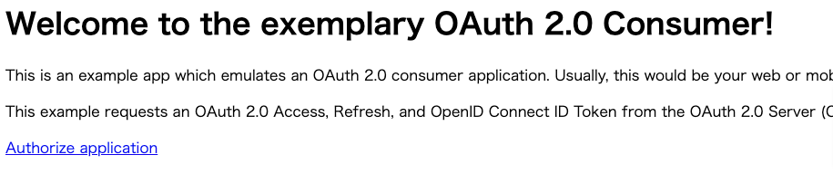

## トークンを生成する方法

## 前提条件

- `just run` でコンテナを起動している
- クライアントを作成している
- kratos のユーザを作成している
  - http://localhost:4455/ から作成できる

## 手順

以下のコマンドを実行してデモ用のクライアントアプリを起動する

```shell
docker exec -it db-hydra-1 \
    hydra perform authorization-code \
    --client-id (client id) \
    --client-secret (client secret) \
    --endpoint http://127.0.0.1:4444/ \
    --port 5555
```

起動したら http://127.0.0.1:5555/ を開く
- 以下の画面が表示される


`Authorize application` をクリックしてログインするとトークンを取得できる